<!--
  ███████╗██╗   ██╗███╗   ██╗ ██████╗ ██████╗
  ██╔════╝╚██╗ ██╔╝████╗  ██║██╔═══██╗██╔══██╗
  ███████╗ ╚████╔╝ ██╔██╗ ██║██║   ██║██║  ██║
  ╚════██║  ╚██╔╝  ██║╚██╗██║██║   ██║██║  ██║
  ███████║   ██║   ██║ ╚████║╚██████╔╝██████╔╝
  ╚══════╝   ╚═╝   ╚═╝  ╚═══╝ ╚═════╝ ╚═════╝
-->

<div align="center">


<br/><br/>

# ⚖️ SYNOD

### *하나의 AI로 부족할 때, 의회를 소집하라.*

<br/>

**[English](README.md)** · **[한국어](README.ko.md)**

<br/>


</div>

<br/>

<div align="center">
<table>
<tr>
<td align="center" width="33%">

### 🎯 문제

단일 LLM은 **과신**합니다.<br/>
환각을 일으킵니다.<br/>
자신의 편향을 확인합니다.

</td>
<td align="center" width="33%">

### ⚔️ 해결책

**토론**하게 하세요.<br/>
입장을 **방어**하게 하세요.<br/>
서로를 **도전**하게 하세요.

</td>
<td align="center" width="33%">

### 🏛️ 결과

**더 나은 결정.**<br/>
환각 감소.<br/>
불확실성 인정.

</td>
</tr>
</table>
</div>

<br/>

---

<br/>

## 🏛️ 의회 회의실

> *"Synod" (그리스어: σύνοδος) — 심의를 위해 소집된 회의.*

```
                              ╔═══════════════════════════════════════╗
                              ║           🏛️ THE SYNOD               ║
                              ╠═══════════════════════════════════════╣
                              ║                                       ║
    ┌─────────────────────────╫───────────────────────────────────────╫─────────────────────────┐
    │                         ║                                       ║                         │
    │   ╭─────────────────╮   ║         ╭─────────────────╮           ║   ╭─────────────────╮   │
    │   │                 │   ║         │                 │           ║   │                 │   │
    │   │   🔵 GEMINI     │   ║         │   🟠 CLAUDE     │           ║   │   🟢 GPT-4o     │   │
    │   │                 │   ║         │                 │           ║   │                 │   │
    │   │   "변호인"      │◀──╫────────▶│   "판사"        │◀──────────╫──▶│   "검사"        │   │
    │   │                 │   ║         │                 │           ║   │                 │   │
    │   │   솔루션을      │   ║         │   종합하고      │           ║   │   약점을        │   │
    │   │   옹호          │   ║         │   결정          │           ║   │   도전          │   │
    │   │                 │   ║         │                 │           ║   │                 │   │
    │   ╰─────────────────╯   ║         ╰─────────────────╯           ║   ╰─────────────────╯   │
    │                         ║                                       ║                         │
    └─────────────────────────╫───────────────────────────────────────╫─────────────────────────┘
                              ║                                       ║
                              ╚═══════════════════════════════════════╝
```

<br/>

---

<br/>

## ⚡ 60초 설정

```bash
# 1️⃣ 설치
/plugin install quantsquirrel/claude-synod-debate

# 2️⃣ 설정 (일회성)
export GEMINI_API_KEY="your-key"
export OPENAI_API_KEY="your-key"

# 3️⃣ 심의
/synod review 이 인증 플로우가 안전한가요?
```

**끝입니다.** 의회가 자동으로 소집됩니다.

<br/>

---

<br/>

## 🎭 세 막의 구조

모든 Synod 세션은 구조화된 심의를 따릅니다:

```mermaid
flowchart LR
    subgraph ACT1["<b>1막</b><br/>━━━━━━━━━━━<br/>해결"]
        direction TB
        G1["🔵 Gemini<br/><i>A안 제시</i>"]
        O1["🟢 OpenAI<br/><i>B안 제시</i>"]
    end

    subgraph ACT2["<b>2막</b><br/>━━━━━━━━━━━<br/>비평"]
        direction TB
        G2["🔵 Gemini<br/><i>B안 공격</i>"]
        O2["🟢 OpenAI<br/><i>A안 공격</i>"]
    end

    subgraph ACT3["<b>3막</b><br/>━━━━━━━━━━━<br/>판결"]
        direction TB
        D["🔵 변호인"]
        J["🟠 판사"]
        P["🟢 검사"]
    end

    ACT1 ==> ACT2 ==> ACT3

    style ACT1 fill:#1e3a5f,stroke:#3b82f6,stroke-width:2px
    style ACT2 fill:#4a1d1d,stroke:#ef4444,stroke-width:2px
    style ACT3 fill:#1a3d1a,stroke:#22c55e,stroke-width:2px
```

<div align="center">



</div>

<br/>

| 막 | 무슨 일이 | 왜 중요한가 |
|:---:|----------|------------|
| **I** | 독립적인 솔루션 등장 | 집단사고 없음, 최대 다양성 |
| **II** | 교차 심문 시작 | 약점 노출, 편향 도전 |
| **III** | 적대적 정제 | 최고의 아이디어가 검증을 통과 |

<br/>

---

<br/>

## 🎯 다섯 가지 심의 모드

<div align="center">

| | 모드 | 소집 시점 | 의회 구성 |
|:---:|:---:|----------|----------|
| 🔍 | **`review`** | 코드, 보안, PR 분석 | Gemini Flash ⚔️ GPT-4o |
| 🏗️ | **`design`** | 시스템 설계 | Gemini Pro ⚔️ GPT-4o |
| 🐛 | **`debug`** | 버그 추적 | Gemini Flash ⚔️ GPT-4o |
| 💡 | **`idea`** | 브레인스토밍 | Gemini Pro ⚔️ GPT-4o |
| 🌐 | **`general`** | 그 외 모든 것 | Gemini Flash ⚔️ GPT-4o |

</div>

<br/>

```bash
/synod review   "이 재귀 함수가 O(n)인가 O(n²)인가?"
/synod design   "일일 1천만 요청을 위한 레이트 리미터 설계"
/synod debug    "왜 화요일에만 실패하는가?"
/synod idea     "결제 이탈률을 어떻게 줄일 수 있을까?"
```

<br/>

---

<br/>

## 📜 학술적 기반

> *Synod는 단순한 래퍼가 아닙니다. 피어리뷰된 심의 프로토콜을 구현합니다.*

<div align="center">

| 프로토콜 | 출처 | Synod 구현 내용 |
|:--------:|------|----------------|
| **ReConcile** | [ACL 2024](https://arxiv.org/abs/2309.13007) | 3라운드 수렴 (품질 향상 >95% 달성) |
| **AgentsCourt** | [arXiv 2024](https://arxiv.org/abs/2408.08089) | 판사/변호인/검사 구조 |
| **ConfMAD** | [arXiv 2025](https://arxiv.org/abs/2502.06233) | 신뢰도 인식 소프트 디퍼 |
| **Free-MAD** | 연구 | 반동조 지침 |
| **SID** | 연구 | 자기신호 기반 신뢰도 |

</div>

<br/>

<details>
<summary><b>📊 신뢰 방정식 (클릭하여 펼치기)</b></summary>

<br/>

Synod는 **CortexDebate** 공식을 사용하여 신뢰를 계산합니다:

```
                    신뢰성 × 일관성 × 관련성
    신뢰 점수 = ────────────────────────────
                      자기 지향성
```

| 요소 | 측정 내용 | 범위 |
|------|----------|:----:|
| **C** | 증거 품질 | 0–1 |
| **R** | 논리적 일관성 | 0–1 |
| **I** | 문제 관련성 | 0–1 |
| **S** | 편향 수준 (낮을수록 좋음) | 0.1–1 |

**해석:**
- `T ≥ 1.5` → 1차 소스 (높은 신뢰)
- `T ≥ 1.0` → 신뢰할 수 있는 입력
- `T ≥ 0.5` → 주의하여 고려
- `T < 0.5` → 합성에서 제외

</details>

<br/>

---

<br/>

## 📦 설치

<details>
<summary><b>플러그인 설치 (권장)</b></summary>

```bash
/plugin install quantsquirrel/claude-synod-debate
```

</details>

<details>
<summary><b>수동 설치</b></summary>

```bash
git clone https://github.com/quantsquirrel/claude-synod-debate.git
cd synod
pip install -r requirements.txt
cp skills/*.md ~/.claude/commands/
chmod +x tools/*.py
export PATH="$PATH:$(pwd)/tools"
```

</details>

<details>
<summary><b>설정</b></summary>

```bash
# 필수
export GEMINI_API_KEY="your-gemini-key"
export OPENAI_API_KEY="your-openai-key"

# 선택
export SYNOD_SESSION_DIR="~/.synod/sessions"
export SYNOD_RETENTION_DAYS=30
```

</details>

<br/>

---

<br/>

## 🎬 데모

> *준비 중입니다. 이 저장소에 스타를 눌러 알림을 받으세요.*

<br/>

---

<br/>

## 🗺️ 로드맵

- [ ] **MCP 서버** — 네이티브 Claude Code 통합
- [ ] **VS Code 확장** — 토론 시각화 GUI
- [ ] **지식 베이스** — 토론 히스토리 학습
- [ ] **웹 대시보드** — 실시간 토론 모니터링
- [ ] **더 많은 LLM** — Llama, Mistral, Claude 변형

<br/>

---

<br/>

<div align="center">

## 🤝 의회에 참여하세요

**[이슈](https://github.com/quantsquirrel/claude-synod-debate/issues)** · **[토론](https://github.com/quantsquirrel/claude-synod-debate/discussions)** · **[기여하기](CONTRIBUTING.md)**

<br/>

```bibtex
@software{synod2026,
  title  = {Synod: Multi-Agent Deliberation for Claude Code},
  author = {quantsquirrel},
  year   = {2026},
  url    = {https://github.com/quantsquirrel/claude-synod-debate}
}
```

<br/>

---

<br/>

**MIT 라이선스** · Copyright © 2026 quantsquirrel

<br/>

*다음 연구의 어깨 위에 서서*<br/>
**ReConcile** · **AgentsCourt** · **ConfMAD** · **Free-MAD** · **SID**

<br/>

<sub>*"의논이 많으면 안전을 얻느니라." — 잠언 11:14*</sub>

</div>
