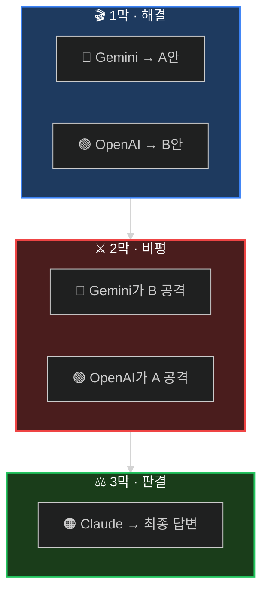

<div align="center">

<!-- Dramatic Title Card -->


<!-- Status Badges with Custom Styling -->
<p>
<a href="#-60초-설정"></a>
<a href="https://arxiv.org/abs/2309.13007"></a>
<a href="LICENSE"></a>
</p>

<!-- Language Toggle -->
**[English](README.md)** · **[한국어](README.ko.md)**

<br/>

<!-- The Trinity -->
<table>
<tr>
<td align="center">
<br/>
<sub><b>🛡️ 변호인</b></sub><br/>
<sub><i>솔루션을 옹호</i></sub>
</td>
<td align="center">
<br/>
<sub><b>⚖️ 판사</b></sub><br/>
<sub><i>판결을 종합</i></sub>
</td>
<td align="center">
<br/>
<sub><b>🗡️ 검사</b></sub><br/>
<sub><i>약점을 공격</i></sub>
</td>
</tr>
</table>

</div>

<br/>

<!-- Problem Statement with Visual Impact -->
<table>
<tr>
<td width="33%" align="center">
<h3>😵‍💫 문제</h3>
<p>
단일 LLM은 <b>과신</b>합니다.<br/>
환각을 일으킵니다.<br/>
자신의 편향을 확인합니다.
</p>
</td>
<td width="33%" align="center">
<h3>⚔️ 해결책</h3>
<p>
<b>토론</b>하게 하세요.<br/>
입장을 <b>방어</b>하게 하세요.<br/>
서로를 <b>도전</b>하게 하세요.
</p>
</td>
<td width="33%" align="center">
<h3>✅ 결과</h3>
<p>
<b>더 나은 결정.</b><br/>
환각 감소.<br/>
불확실성 인정.
</p>
</td>
</tr>
</table>

<br/>

---

<div align="center">

## 🎭 세 막의 구조

*모든 심의는 동일한 드라마 구조를 따릅니다*

</div>

<br/>



<div align="center">

| 막 | 무슨 일이 | 왜 중요한가 |
|:---:|:----------|:------------|
| **I** | 독립적인 솔루션 등장 | 집단사고 없음 — 최대 다양성 |
| **II** | 교차 심문 시작 | 약점 노출 — 편향 도전 |
| **III** | 적대적 정제 | 최고의 아이디어가 검증 통과 |

</div>

<br/>

---

<div align="center">

## ⚡ 60초 설정

</div>

```bash
# 1️⃣ 플러그인 설치
/plugin install quantsquirrel/claude-synod-debate

# 2️⃣ API 키 설정 (일회성)
export GEMINI_API_KEY="your-gemini-key"
export OPENAI_API_KEY="your-openai-key"

# 3️⃣ 의회 소집
/synod review 이 인증 플로우가 안전한가요?
```

<div align="center">

**끝입니다.** 의회가 자동으로 소집됩니다.

<br/>


</div>

<br/>

---

<div align="center">

## 🎯 다섯 가지 심의 모드

*의회 구성을 선택하세요*

</div>

<br/>

<div align="center">

| | 모드 | 소집 시점 | 구성 |
|:---:|:---:|:----------|:-----|
| 🔍 | **`review`** | 코드, 보안, PR 분석 | `Gemini Flash` ⚔️ `GPT-4o` |
| 🏗️ | **`design`** | 시스템 설계 | `Gemini Pro` ⚔️ `GPT-4o` |
| 🐛 | **`debug`** | 버그 추적 | `Gemini Flash` ⚔️ `GPT-4o` |
| 💡 | **`idea`** | 브레인스토밍 | `Gemini Pro` ⚔️ `GPT-4o` |
| 🌐 | **`general`** | 그 외 모든 것 | `Gemini Flash` ⚔️ `GPT-4o` |

</div>

<br/>

<details>
<summary><b>📝 예제 명령어</b></summary>

<br/>

```bash
# 코드 리뷰
/synod review "이 재귀 함수가 O(n)인가 O(n²)인가?"

# 시스템 설계
/synod design "일일 1천만 요청을 위한 레이트 리미터 설계"

# 디버깅
/synod debug "왜 화요일에만 실패하는가?"

# 브레인스토밍
/synod idea "결제 이탈률을 어떻게 줄일 수 있을까?"
```

</details>

<br/>

---

<div align="center">

## 📜 학술적 기반

*단순한 래퍼가 아닙니다 — 피어리뷰된 심의 프로토콜*

</div>

<br/>

<div align="center">

| 프로토콜 | 출처 | Synod 구현 내용 |
|:--------:|:-----|:----------------|
| **ReConcile** | [ACL 2024](https://arxiv.org/abs/2309.13007) | 3라운드 수렴 (>95% 품질 향상) |
| **AgentsCourt** | [arXiv 2024](https://arxiv.org/abs/2408.08089) | 판사/변호인/검사 구조 |
| **ConfMAD** | [arXiv 2025](https://arxiv.org/abs/2502.06233) | 신뢰도 인식 소프트 디퍼 |
| **Free-MAD** | 연구 | 반동조 지침 |
| **SID** | 연구 | 자기신호 기반 신뢰도 |

</div>

<br/>

<details>
<summary><b>📊 신뢰 방정식</b></summary>

<br/>

Synod는 **CortexDebate** 공식으로 신뢰를 계산합니다:

```
                신뢰성 × 일관성 × 관련성
신뢰 점수 = ────────────────────────────
                  자기 지향성
```

| 요소 | 측정 내용 | 범위 |
|:----:|:---------|:----:|
| **C** | 증거 품질 | 0–1 |
| **R** | 논리적 일관성 | 0–1 |
| **I** | 문제 관련성 | 0–1 |
| **S** | 편향 수준 (낮을수록 좋음) | 0.1–1 |

**해석:**
- `T ≥ 1.5` → 1차 소스 (높은 신뢰)
- `T ≥ 1.0` → 신뢰할 수 있는 입력
- `T ≥ 0.5` → 주의하여 고려
- `T < 0.5` → 합성에서 제외

</details>

<br/>

---

<div align="center">

## 📦 설치

</div>

<details>
<summary><b>🚀 플러그인 설치 (권장)</b></summary>

<br/>

```bash
/plugin install quantsquirrel/claude-synod-debate
```

</details>

<details>
<summary><b>🔧 수동 설치</b></summary>

<br/>

```bash
git clone https://github.com/quantsquirrel/claude-synod-debate.git
cd synod
pip install -r requirements.txt
cp skills/*.md ~/.claude/commands/
chmod +x tools/*.py
export PATH="$PATH:$(pwd)/tools"
```

</details>

<details>
<summary><b>⚙️ 설정</b></summary>

<br/>

```bash
# 필수
export GEMINI_API_KEY="your-gemini-key"
export OPENAI_API_KEY="your-openai-key"

# 선택
export SYNOD_SESSION_DIR="~/.synod/sessions"
export SYNOD_RETENTION_DAYS=30
```

</details>

<br/>

---

<div align="center">

## 🗺️ 로드맵

</div>

- [ ] **MCP 서버** — 네이티브 Claude Code 통합
- [ ] **VS Code 확장** — 토론 시각화 GUI
- [ ] **지식 베이스** — 토론 히스토리 학습
- [ ] **웹 대시보드** — 실시간 토론 모니터링
- [ ] **더 많은 LLM** — Llama, Mistral, Claude 변형

<br/>

---

<div align="center">

## 🤝 의회에 참여하세요

**[이슈](https://github.com/quantsquirrel/claude-synod-debate/issues)** · **[토론](https://github.com/quantsquirrel/claude-synod-debate/discussions)** · **[기여하기](CONTRIBUTING.md)**

<br/>

<details>
<summary><b>📖 인용</b></summary>

```bibtex
@software{synod2026,
  title   = {Synod: Multi-Agent Deliberation for Claude Code},
  author  = {quantsquirrel},
  year    = {2026},
  url     = {https://github.com/quantsquirrel/claude-synod-debate}
}
```

</details>

<br/>

**MIT 라이선스** · Copyright © 2026 quantsquirrel

*다음 연구의 어깨 위에 서서*<br/>
**ReConcile** · **AgentsCourt** · **ConfMAD** · **Free-MAD** · **SID**

<br/>

> *"의논이 많으면 안전을 얻느니라."*<br/>
> — 잠언 11:14

<br/>


</div>
