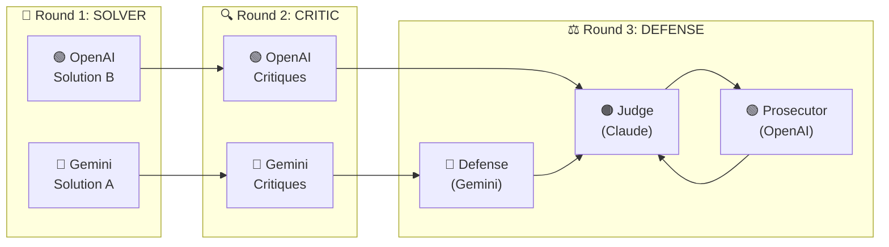

<p align="center">
  
  
  
</p>

<p align="center">
  <a href="README.md">English</a> | <a href="README.ko.md">한국어</a>
</p>

<h1 align="center">Synod</h1>

<p align="center">
  <strong>Multi-Agent Deliberation for Claude Code</strong><br/>
  <em>Structured debate between Claude, Gemini, and OpenAI for better decision-making</em>
</p>

<p align="center">
  
  
  
</p>

---

## Why Synod?

> Single LLMs suffer from **confirmation bias**, **hallucination**, and **overconfidence**.
> Synod forces multiple AI models to debate, defend positions, and acknowledge uncertainty.



---

## Quick Start

### 1. Install

```bash
/plugin install quantsquirrel/claude-synod-debate
```

### 2. Configure API Keys

```bash
export GEMINI_API_KEY="your-gemini-key"
export OPENAI_API_KEY="your-openai-key"
```

### 3. Start Debating

```bash
/synod review  Is this authentication flow secure?
/synod design  Design a scalable microservices architecture
/synod debug   Why is this race condition occurring?
```

---

## Features

| Feature | Description |
|---------|-------------|
| **3-Round Structured Debate** | Solver → Critic → Defense/Prosecution |
| **Confidence Scoring** | 0-100 scale with semantic focus (SID methodology) |
| **Trust Calculation** | CortexDebate formula: `(C × R × I) / S` |
| **Anti-Conformity** | Free-MAD prevents premature consensus |
| **Session Resume** | Continue previous debates with `/synod resume` |
| **5 Specialized Modes** | review, design, debug, idea, general |

---

## Modes

| Mode | Best For | Models | Rounds |
|:----:|----------|--------|:------:|
| `review` | Code review, security analysis | Gemini Flash + GPT-4o | 3 |
| `design` | Architecture, system design | Gemini Pro + GPT-4o | 4 |
| `debug` | Troubleshooting, root cause analysis | Gemini Flash + GPT-4o | 3 |
| `idea` | Brainstorming, feature ideation | Gemini Pro + GPT-4o | 4 |
| `general` | General questions | Gemini Flash + GPT-4o | 3 |

---

## Research Foundation

Synod is built on peer-reviewed multi-agent debate research:

| Methodology | Paper | Contribution |
|-------------|-------|--------------|
| **ReConcile** | [ACL 2024](https://arxiv.org/abs/2309.13007) | 3-round convergence pattern |
| **AgentsCourt** | [2024](https://arxiv.org/abs/2408.08089) | Courtroom-style adversarial debate |
| **ConfMAD** | [2025](https://arxiv.org/abs/2502.06233) | Confidence-aware soft defer |
| **A-HMAD** | [AI & Ethics 2025](https://link.springer.com/article/10.1007/s44443-025-00353-3) | Human-like deliberation |

> Research shows **3-round debates capture >95% of quality improvements** with diminishing returns thereafter.

---

## Installation

### Prerequisites

- Claude Code CLI v1.0.0+
- Python 3.9+
- API Keys: `GEMINI_API_KEY`, `OPENAI_API_KEY`

### Plugin Installation (Recommended)

```bash
/plugin install quantsquirrel/claude-synod-debate
```

### Manual Installation

```bash
git clone https://github.com/quantsquirrel/claude-synod-debate.git
cd synod
pip install -r requirements.txt
cp skills/*.md ~/.claude/commands/
chmod +x tools/*.py
export PATH="$PATH:$(pwd)/tools"
```

---

## Usage Examples

### Code Review
```bash
/synod review Analyze the performance implications of this recursive function
```

### Architecture Design
```bash
/synod design Design a JWT authentication system with refresh tokens
```

### Debugging
```bash
/synod debug Why is this test flaky? It passes locally but fails in CI
```

### Brainstorming
```bash
/synod idea How can we improve user onboarding conversion rates?
```

### Resume Previous Session
```bash
/synod resume                              # Most recent session
/synod resume synod-20260124-143022-a1b    # Specific session
```

---

## Output Format

Each agent outputs structured confidence scores:

```xml
<confidence score="85">
  <evidence>Specific evidence supporting this position</evidence>
  <logic>Reasoning chain</logic>
  <expertise>Domain expertise applied</expertise>
  <can_exit>true</can_exit>
</confidence>

<semantic_focus>
1. Primary claim
2. Secondary claim
3. Tertiary claim
</semantic_focus>
```

### Score Interpretation

| Score | Meaning | Action |
|:-----:|---------|--------|
| **80+** | High confidence | Consensus-ready |
| **60-79** | Moderate confidence | Needs refinement |
| **<60** | Low confidence | Requires more analysis |

---

## Trust Score Calculation

Synod uses the **CortexDebate** formula to calculate trust:

```
T = min((C × R × I) / S, 2.0)
```

| Factor | Description | Range |
|--------|-------------|:-----:|
| **C** (Credibility) | Evidence quality | 0-1 |
| **R** (Reliability) | Logical consistency | 0-1 |
| **I** (Intimacy) | Problem relevance | 0-1 |
| **S** (Self-Orientation) | Bias level (lower = better) | 0.1-1 |

| Trust Level | Threshold | Treatment |
|-------------|:---------:|-----------|
| High | T ≥ 1.5 | Primary source |
| Good | T ≥ 1.0 | Reliable input |
| Acceptable | T ≥ 0.5 | Consider with caution |
| Exclude | T < 0.5 | Omit from synthesis |

---

## Session Management

Sessions are stored in `~/.synod/sessions/`:

```
synod-YYYYMMDD-HHMMSS-xxx/
├── meta.json              # Session metadata
├── status.json            # Current status
├── round-1-solver/        # Solver outputs
│   ├── gemini_response.json
│   └── openai_response.json
├── round-2-critic/        # Critic outputs
└── round-3-defense/       # Defense outputs
```

---

## Configuration

### Environment Variables

```bash
# Required
export GEMINI_API_KEY="your-gemini-key"
export OPENAI_API_KEY="your-openai-key"

# Optional
export SYNOD_SESSION_DIR="~/.synod/sessions"
export SYNOD_RETENTION_DAYS=30
```

### Custom Models

Override defaults in `.claude/synod-config.json`:

```json
{
  "modes": {
    "review": { "solver": "gemini-2.0-flash", "critic": "gpt-4o" },
    "design": { "solver": "gemini-2.0-pro", "critic": "gpt-4-turbo" }
  }
}
```

---

## Troubleshooting

| Problem | Solution |
|---------|----------|
| `API key not found` | Export `GEMINI_API_KEY` and `OPENAI_API_KEY` |
| `Session directory error` | Run `mkdir -p ~/.synod/sessions` |
| `Command not found` | Install via `/plugin install quantsquirrel/claude-synod-debate` |
| `Timeout after retries` | Check network and API service status |

### Timeout Handling

Synod includes automatic retry with graceful degradation:

1. **First timeout**: Retry with exponential backoff
2. **Second timeout**: Downgrade model capabilities
3. **Third timeout**: Use cached response or return error

---

## Performance

| Metric | Value |
|--------|-------|
| **Debate duration** | 2-5 minutes |
| **Token usage** | 5,000-15,000 per debate |
| **Execution** | Parallel within rounds |
| **Caching** | Recent sessions cached |

---

## Contributing

We welcome contributions!

```bash
git clone https://github.com/quantsquirrel/claude-synod-debate.git
cd synod
pip install -r requirements-dev.txt
pytest tests/
```

- [Open an Issue](https://github.com/quantsquirrel/claude-synod-debate/issues)
- [Join Discussions](https://github.com/quantsquirrel/claude-synod-debate/discussions)

---

## Citation

```bibtex
@software{synod2026,
  title = {Synod: Multi-Agent Deliberation System for Claude Code},
  author = {quantsquirrel},
  year = {2026},
  url = {https://github.com/quantsquirrel/claude-synod-debate}
}
```

---

## License

MIT License - see [LICENSE](LICENSE) for details.

Copyright (c) 2026 quantsquirrel

---

<p align="center">
  <strong>Built with insights from</strong><br/>
  CortexDebate • Free-MAD • SID • ReConcile
</p>
