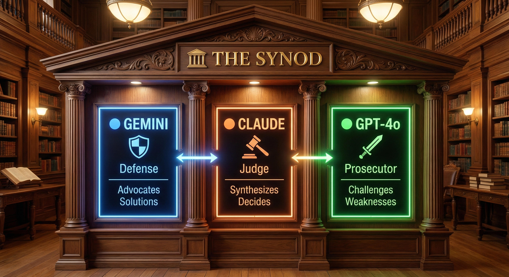
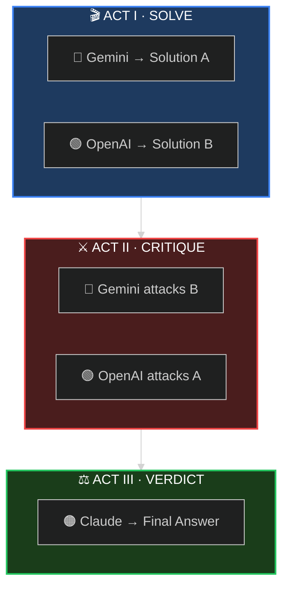

<div align="center">

<!-- Hero Banner -->


<br/>

<!-- Tagline -->
### *When one AI isn't enough, convene the council.*

<br/>

<!-- Status Badges -->
<p>
<a href="#-60-second-setup"></a>
<a href="https://arxiv.org/abs/2309.13007"></a>
<a href="LICENSE"></a>
<a href="https://github.com/quantsquirrel/claude-synod-debate"></a>
</p>

<!-- Language Toggle -->
**[English](README.md)** · **[한국어](README.ko.md)**

</div>

<br/>

<!-- Problem Statement with Visual Impact -->
<table>
<tr>
<td width="33%" align="center">
<h3>😵‍💫 THE PROBLEM</h3>
<p>
Single LLMs are <b>overconfident</b>.<br/>
They hallucinate.<br/>
They confirm their own biases.
</p>
</td>
<td width="33%" align="center">
<h3>⚔️ THE SOLUTION</h3>
<p>
Force them to <b>debate</b>.<br/>
Make them <b>defend</b> positions.<br/>
Let them <b>challenge</b> each other.
</p>
</td>
<td width="33%" align="center">
<h3>✅ THE RESULT</h3>
<p>
<b>Better decisions.</b><br/>
Reduced hallucinations.<br/>
Acknowledged uncertainty.
</p>
</td>
</tr>
</table>

<br/>

---

<div align="center">

## 🎭 THE THREE ACTS

*Every deliberation follows the same dramatic structure*

</div>

<br/>



<div align="center">

| Act | What Happens | Why It Matters |
|:---:|:-------------|:---------------|
| **I** | Independent solutions emerge | No groupthink — maximum diversity |
| **II** | Cross-examination begins | Weaknesses exposed — biases challenged |
| **III** | Adversarial refinement | Best ideas survive scrutiny |

</div>

<br/>

---

<div align="center">

## ⚡ 60-SECOND SETUP

</div>

```bash
# 1️⃣ Install the plugin
/plugin install quantsquirrel/claude-synod-debate

# 2️⃣ Set your API keys (one-time)
export GEMINI_API_KEY="your-gemini-key"
export OPENAI_API_KEY="your-openai-key"

# 3️⃣ Summon the council
/synod review Is this authentication flow secure?
```

<div align="center">

**That's it.** The council convenes automatically.

<br/>


</div>

<br/>

---

<div align="center">

## 🎯 FIVE MODES OF DELIBERATION

*Choose your council configuration*

</div>

<br/>

<div align="center">

| | Mode | Summon When... | Configuration |
|:---:|:---:|:---------------|:--------------|
| 🔍 | **`review`** | Analyzing code, security, PRs | `Gemini Flash` ⚔️ `GPT-4o` |
| 🏗️ | **`design`** | Architecting systems | `Gemini Pro` ⚔️ `GPT-4o` |
| 🐛 | **`debug`** | Hunting elusive bugs | `Gemini Flash` ⚔️ `GPT-4o` |
| 💡 | **`idea`** | Brainstorming solutions | `Gemini Pro` ⚔️ `GPT-4o` |
| 🌐 | **`general`** | Everything else | `Gemini Flash` ⚔️ `GPT-4o` |

</div>

<br/>

<details>
<summary><b>📝 Example Commands</b></summary>

<br/>

```bash
# Code review
/synod review "Is this recursive function O(n) or O(n²)?"

# System design
/synod design "Design a rate limiter for 10M requests/day"

# Debugging
/synod debug "Why does this only fail on Tuesdays?"

# Brainstorming
/synod idea "How do we reduce checkout abandonment?"
```

</details>

<br/>

---

<div align="center">

## 📜 ACADEMIC FOUNDATION

*Not just another wrapper — peer-reviewed deliberation protocols*

</div>

<br/>

<div align="center">

| Protocol | Source | What Synod Implements |
|:--------:|:-------|:----------------------|
| **ReConcile** | [ACL 2024](https://arxiv.org/abs/2309.13007) | 3-round convergence (>95% quality gains) |
| **AgentsCourt** | [arXiv 2024](https://arxiv.org/abs/2408.08089) | Judge/Defense/Prosecutor structure |
| **ConfMAD** | [arXiv 2025](https://arxiv.org/abs/2502.06233) | Confidence-aware soft defer |
| **Free-MAD** | Research | Anti-conformity instructions |
| **SID** | Research | Self-signals driven confidence |

</div>

<br/>

<details>
<summary><b>📊 The Trust Equation</b></summary>

<br/>

Synod calculates trust using the **CortexDebate** formula:

```
                Credibility × Reliability × Intimacy
Trust Score = ────────────────────────────────────────
                      Self-Orientation
```

| Factor | Measures | Range |
|:------:|:---------|:-----:|
| **C** | Evidence quality | 0–1 |
| **R** | Logical consistency | 0–1 |
| **I** | Problem relevance | 0–1 |
| **S** | Bias level (lower = better) | 0.1–1 |

**Interpretation:**
- `T ≥ 1.5` → Primary source (high trust)
- `T ≥ 1.0` → Reliable input
- `T ≥ 0.5` → Consider with caution
- `T < 0.5` → Excluded from synthesis

</details>

<br/>

---

<div align="center">

## 📦 INSTALLATION

</div>

<details>
<summary><b>🚀 Plugin Installation (Recommended)</b></summary>

<br/>

```bash
/plugin install quantsquirrel/claude-synod-debate
```

</details>

<details>
<summary><b>🔧 Manual Installation</b></summary>

<br/>

```bash
git clone https://github.com/quantsquirrel/claude-synod-debate.git
cd synod
pip install -r requirements.txt
cp skills/*.md ~/.claude/commands/
chmod +x tools/*.py
export PATH="$PATH:$(pwd)/tools"
```

</details>

<details>
<summary><b>⚙️ Configuration</b></summary>

<br/>

```bash
# Required
export GEMINI_API_KEY="your-gemini-key"
export OPENAI_API_KEY="your-openai-key"

# Optional
export SYNOD_SESSION_DIR="~/.synod/sessions"
export SYNOD_RETENTION_DAYS=30
```

</details>

<br/>

---

<div align="center">

## 🗺️ ROADMAP

</div>

- [ ] **MCP Server** — Native Claude Code integration
- [ ] **VS Code Extension** — GUI for debate visualization
- [ ] **Knowledge Base** — Learning from debate history
- [ ] **Web Dashboard** — Real-time debate monitoring
- [ ] **More LLMs** — Llama, Mistral, Claude variants

<br/>

---

<div align="center">

## 🤝 JOIN THE COUNCIL

**[Issues](https://github.com/quantsquirrel/claude-synod-debate/issues)** · **[Discussions](https://github.com/quantsquirrel/claude-synod-debate/discussions)** · **[Contributing](CONTRIBUTING.md)**

<br/>

<details>
<summary><b>📖 Citation</b></summary>

```bibtex
@software{synod2026,
  title   = {Synod: Multi-Agent Deliberation for Claude Code},
  author  = {quantsquirrel},
  year    = {2026},
  url     = {https://github.com/quantsquirrel/claude-synod-debate}
}
```

</details>

<br/>

**MIT License** · Copyright © 2026 quantsquirrel

*Built on the shoulders of*<br/>
**ReConcile** · **AgentsCourt** · **ConfMAD** · **Free-MAD** · **SID**

<br/>

> *"In the multitude of counselors there is safety."* — Proverbs 11:14

</div>
