<!--
  ███████╗██╗   ██╗███╗   ██╗ ██████╗ ██████╗
  ██╔════╝╚██╗ ██╔╝████╗  ██║██╔═══██╗██╔══██╗
  ███████╗ ╚████╔╝ ██╔██╗ ██║██║   ██║██║  ██║
  ╚════██║  ╚██╔╝  ██║╚██╗██║██║   ██║██║  ██║
  ███████║   ██║   ██║ ╚████║╚██████╔╝██████╔╝
  ╚══════╝   ╚═╝   ╚═╝  ╚═══╝ ╚═════╝ ╚═════╝
-->

<div align="center">


<br/><br/>

# ⚖️ SYNOD

### *When one AI isn't enough, convene the council.*

<br/>

**[English](README.md)** · **[한국어](README.ko.md)**

<br/>


</div>

<br/>

<div align="center">
<table>
<tr>
<td align="center" width="33%">

### 🎯 The Problem

Single LLMs are **overconfident**.<br/>
They hallucinate.<br/>
They confirm their own biases.

</td>
<td align="center" width="33%">

### ⚔️ The Solution

Force them to **debate**.<br/>
Make them **defend** positions.<br/>
Let them **challenge** each other.

</td>
<td align="center" width="33%">

### 🏛️ The Result

**Better decisions.**<br/>
Reduced hallucinations.<br/>
Acknowledged uncertainty.

</td>
</tr>
</table>
</div>

<br/>

---

<br/>

## 🏛️ The Council Chamber

> *"Synod" (Greek: σύνοδος) — an assembly convened to deliberate.*

```
                              ╔═══════════════════════════════════════╗
                              ║           🏛️ THE SYNOD               ║
                              ╠═══════════════════════════════════════╣
                              ║                                       ║
    ┌─────────────────────────╫───────────────────────────────────────╫─────────────────────────┐
    │                         ║                                       ║                         │
    │   ╭─────────────────╮   ║         ╭─────────────────╮           ║   ╭─────────────────╮   │
    │   │                 │   ║         │                 │           ║   │                 │   │
    │   │   🔵 GEMINI     │   ║         │   🟠 CLAUDE     │           ║   │   🟢 GPT-4o     │   │
    │   │                 │   ║         │                 │           ║   │                 │   │
    │   │   "Defense"     │◀──╫────────▶│   "Judge"       │◀──────────╫──▶│   "Prosecutor"  │   │
    │   │                 │   ║         │                 │           ║   │                 │   │
    │   │   Advocates     │   ║         │   Synthesizes   │           ║   │   Challenges    │   │
    │   │   Solutions     │   ║         │   Decides       │           ║   │   Weaknesses    │   │
    │   │                 │   ║         │                 │           ║   │                 │   │
    │   ╰─────────────────╯   ║         ╰─────────────────╯           ║   ╰─────────────────╯   │
    │                         ║                                       ║                         │
    └─────────────────────────╫───────────────────────────────────────╫─────────────────────────┘
                              ║                                       ║
                              ╚═══════════════════════════════════════╝
```

<br/>

---

<br/>

## ⚡ 60-Second Setup

```bash
# 1️⃣ Install
/plugin install quantsquirrel/claude-synod-debate

# 2️⃣ Configure (one-time)
export GEMINI_API_KEY="your-key"
export OPENAI_API_KEY="your-key"

# 3️⃣ Deliberate
/synod review Is this auth flow secure?
```

**That's it.** The council convenes automatically.

<br/>

---

<br/>

## 🎭 The Three Acts

Every Synod session follows a structured deliberation:

```mermaid
flowchart LR
    subgraph ACT1["<b>ACT I</b><br/>━━━━━━━━━━━<br/>SOLVE"]
        direction TB
        G1["🔵 Gemini<br/><i>proposes A</i>"]
        O1["🟢 OpenAI<br/><i>proposes B</i>"]
    end

    subgraph ACT2["<b>ACT II</b><br/>━━━━━━━━━━━<br/>CRITIQUE"]
        direction TB
        G2["🔵 Gemini<br/><i>attacks B</i>"]
        O2["🟢 OpenAI<br/><i>attacks A</i>"]
    end

    subgraph ACT3["<b>ACT III</b><br/>━━━━━━━━━━━<br/>VERDICT"]
        direction TB
        D["🔵 Defense"]
        J["🟠 Judge"]
        P["🟢 Prosecutor"]
    end

    ACT1 ==> ACT2 ==> ACT3

    style ACT1 fill:#1e3a5f,stroke:#3b82f6,stroke-width:2px
    style ACT2 fill:#4a1d1d,stroke:#ef4444,stroke-width:2px
    style ACT3 fill:#1a3d1a,stroke:#22c55e,stroke-width:2px
```

<div align="center">



</div>

<br/>

| Act | What Happens | Why It Matters |
|:---:|--------------|----------------|
| **I** | Independent solutions emerge | No groupthink, maximum diversity |
| **II** | Cross-examination begins | Weaknesses exposed, biases challenged |
| **III** | Adversarial refinement | Best ideas survive scrutiny |

<br/>

---

<br/>

## 🎯 Five Modes of Deliberation

<div align="center">

| | Mode | Summon When... | Council Configuration |
|:---:|:---:|----------------|----------------------|
| 🔍 | **`review`** | Analyzing code, security, PRs | Gemini Flash ⚔️ GPT-4o |
| 🏗️ | **`design`** | Architecting systems | Gemini Pro ⚔️ GPT-4o |
| 🐛 | **`debug`** | Hunting elusive bugs | Gemini Flash ⚔️ GPT-4o |
| 💡 | **`idea`** | Brainstorming solutions | Gemini Pro ⚔️ GPT-4o |
| 🌐 | **`general`** | Everything else | Gemini Flash ⚔️ GPT-4o |

</div>

<br/>

```bash
/synod review   "Is this recursive function O(n) or O(n²)?"
/synod design   "Design a rate limiter for 10M requests/day"
/synod debug    "Why does this only fail on Tuesdays?"
/synod idea     "How do we reduce checkout abandonment?"
```

<br/>

---

<br/>

## 📜 Academic Foundation

> *Synod is not just another wrapper. It implements peer-reviewed deliberation protocols.*

<div align="center">

| Protocol | Source | What Synod Implements |
|:--------:|--------|----------------------|
| **ReConcile** | [ACL 2024](https://arxiv.org/abs/2309.13007) | 3-round convergence (captures >95% quality gains) |
| **AgentsCourt** | [arXiv 2024](https://arxiv.org/abs/2408.08089) | Judge/Defense/Prosecutor structure |
| **ConfMAD** | [arXiv 2025](https://arxiv.org/abs/2502.06233) | Confidence-aware soft defer |
| **Free-MAD** | Research | Anti-conformity instructions |
| **SID** | Research | Self-signals driven confidence |

</div>

<br/>

<details>
<summary><b>📊 The Trust Equation (click to expand)</b></summary>

<br/>

Synod calculates trust using the **CortexDebate** formula:

```
                    Credibility × Reliability × Intimacy
    Trust Score = ────────────────────────────────────────
                          Self-Orientation
```

| Factor | Measures | Range |
|--------|----------|:-----:|
| **C** | Evidence quality | 0–1 |
| **R** | Logical consistency | 0–1 |
| **I** | Problem relevance | 0–1 |
| **S** | Bias level (lower = better) | 0.1–1 |

**Interpretation:**
- `T ≥ 1.5` → Primary source (high trust)
- `T ≥ 1.0` → Reliable input
- `T ≥ 0.5` → Consider with caution
- `T < 0.5` → Excluded from synthesis

</details>

<br/>

---

<br/>

## 📦 Installation

<details>
<summary><b>Plugin Installation (Recommended)</b></summary>

```bash
/plugin install quantsquirrel/claude-synod-debate
```

</details>

<details>
<summary><b>Manual Installation</b></summary>

```bash
git clone https://github.com/quantsquirrel/claude-synod-debate.git
cd synod
pip install -r requirements.txt
cp skills/*.md ~/.claude/commands/
chmod +x tools/*.py
export PATH="$PATH:$(pwd)/tools"
```

</details>

<details>
<summary><b>Configuration</b></summary>

```bash
# Required
export GEMINI_API_KEY="your-gemini-key"
export OPENAI_API_KEY="your-openai-key"

# Optional
export SYNOD_SESSION_DIR="~/.synod/sessions"
export SYNOD_RETENTION_DAYS=30
```

</details>

<br/>

---

<br/>

## 🎬 Demo

> *Coming soon. Star this repo to get notified.*

<br/>

---

<br/>

## 🗺️ Roadmap

- [ ] **MCP Server** — Native Claude Code integration
- [ ] **VS Code Extension** — GUI for debate visualization
- [ ] **Knowledge Base** — Learning from debate history
- [ ] **Web Dashboard** — Real-time debate monitoring
- [ ] **More LLMs** — Llama, Mistral, Claude variants

<br/>

---

<br/>

<div align="center">

## 🤝 Join the Council

**[Issues](https://github.com/quantsquirrel/claude-synod-debate/issues)** · **[Discussions](https://github.com/quantsquirrel/claude-synod-debate/discussions)** · **[Contributing](CONTRIBUTING.md)**

<br/>

```bibtex
@software{synod2026,
  title  = {Synod: Multi-Agent Deliberation for Claude Code},
  author = {quantsquirrel},
  year   = {2026},
  url    = {https://github.com/quantsquirrel/claude-synod-debate}
}
```

<br/>

---

<br/>

**MIT License** · Copyright © 2026 quantsquirrel

<br/>

*Built on the shoulders of*<br/>
**ReConcile** · **AgentsCourt** · **ConfMAD** · **Free-MAD** · **SID**

<br/>

<sub>*"In the multitude of counselors there is safety." — Proverbs 11:14*</sub>

</div>
